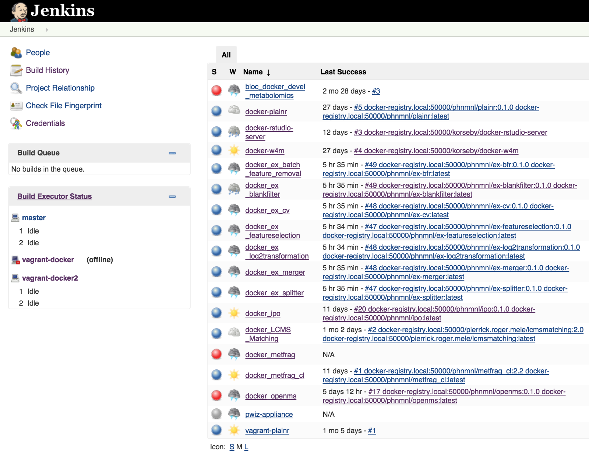

# Galaxy and k8s on the EBI-EMBASSY Cloud

This part of the demo builds on work kindly shared by [Stephanie](https://github.com/stephanieherman), [Payam](https://github.com/PayamEmami), Anders, [Marco](https://github.com/mcapuccini) and Ola, our friends at Uppsala. We use their workflow and image container definitions available [here](https://github.com/phnmnl/workflow-demo) (you don't need to follow that link to continue).


The integration work between Galaxy/W4M and Kubernetes was written in collaboration with [Pierrick ROGER](https://github.com/pierrickrogermele) from CEA, France.

Since we are using a different k8s cluster now, we need to swap the `~/.kube/config` file to get the adequate authentication to use the EMBASSY Cloud installation (which is provisioned through [this](https://github.com/phnmnl/mantl-kubernetes) MANTL kubernetes setup).

```
mv ~/.kube/config ~/.kube/config_gcloud
ln -s ~/.kube/config_embassy ~/.kube/config
```

## From a dockerfile to a deployable job 

Here we will describe how to go from a dockerfile codified tool to something that we run on Galaxy (the W4M) installation and that is offloaded (the heavy computation) to the Kubernetes cluster.

In this case, everything will be executed from the W4M VM image running on the EBI-EMBASSY Cloud.

### Dockerfile is built and pushed to an accesible hub for the k8s cluster

At the EMBASSY Cloud we have our own instance of Jenkins which has hooks to the dockerfile github repos that we are interested. You can access our live instance [here](http://phenomenal-h2020.eu/jenkins/)



So, for instance, the first step of the Uppsala's demo workflow, the BlankFilter, whose dockerfile is [here](https://github.com/phnmnl/workflow-demo/blob/master/BlankFilter/Dockerfile) and looks like this:

```dockerfile
FROM r-base
MAINTAINER Stephanie Herman, stephanie.herman.3820@student.uu.se

ADD BlankFilter.r /
ENTRYPOINT ["Rscript", "BlankFilter.r"] 
```

and this is built (as in `docker build -t phnmnl/ex-blankfilter .`) by our EMBASSY Cloud Jenkins, and subsequently pushed to our internal docker registry.

### Job execution and shared file system  

From here, I will execute everything from our W4M VM, on our EMBASSY Cloud. We need to get out of the Galaxy/W4M default Python development environment.

```bash
deactivate
```

So, to execute that first step of the Uppsala example workflow, we would first need to somehow upload the data "somewhere", that would be our shared filesystem:

```bash
ls -l /mnt/glusterfs/uppsala-ex/
```

and then execute:

```bash
cd /galaxy/dist/phenomenal/k8s_demo/embassy_demo
kubectl create -f run_blankfilter_step.yaml
POD=`kubectl describe -f run_blankfilter_step.yaml | grep 'pod:' | awk -F'pod: ' '{ print $2 }'`
kubectl describe pods/$POD
```

where the run_blankfilter_step.yaml (part of the repository) looks like this:

```yaml
apiVersion: extensions/v1beta1
kind: Job
metadata:
  name: blankfilter-ex
spec:
  selector:
    matchLabels:
      app: bf-ex
  template:
    metadata:
      name: bf-ex
      labels:
         app: bf-ex
    spec:
      containers:
      - name: blankfilter
        image: docker-registry.local:50000/phnmnl/ex-blankfilter:latest
        args:
                - /mnt/glusterfs/uppsala-ex/inputdata_workshop.xls
                - /mnt/glusterfs/uppsala-ex/output_blankfilter_workshop.xls
        volumeMounts: 
          - name: glusterfsvol
            mountPath: /mnt/glusterfs
      restartPolicy: Never
      volumes: 
         - name: glusterfsvol
           glusterfs: 
               endpoints: glusterfs-cluster
               path: scratch
               readOnly: false
```

And we can see the output file of the run here:

```
ls -l /mnt/glusterfs/uppsala-ex/
less /mnt/glusterfs/uppsala-ex/output_blankfilter_workshop.xls
```

### Two is company, (but) three's a crowd

However, Galaxy is used to wait for the executable to finish to go and find result files. The `kubectl` API wrapper doesn't wait for jobs to finish, it only submits then. Hence, we wrote a [k8s-helper tool](https://github.com/phnmnl/k8s-helper) to interface `Galaxy` to `kubectl`. This tool sends a job to k8s through `kubectl`, interacts with `kubectl` until the job is done, to exit when this happens. By using `kubectl` as a dependency, we left to that tool the whole authentication process, finished job removal, failed job handling, etc. In the long term possible we should develop something that makes use of the REST API directly, but for proof of concept, this is fine.

We will first illustrate the use of k8s-helper on its own, and later show how Galaxy makes use of it. To execute the very same job that we just run, this time through k8s-helper, we execute:

```
submit_k8s_job -j blankfilter -n blankfilter -c blankfilter \
--cimgrepos docker-registry.local:50000 \
--cimgowner phnmnl \
--cimgname ex-blankfilter \
--cimgver latest \
--volpath /mnt/glusterfs \
--volname glusterfsvol \
--glusterfspath scratch \
-- \
/mnt/glusterfs/uppsala-ex/inputdata_workshop.xls \
/mnt/glusterfs/uppsala-ex/output_blankfilter_k8s_helper.xls
```

We can check output files.

### Calling k8s-helper from galaxy

Now we will showcase how can Galaxy (the W4M installation), can interact with Kubernetes through the helper.

First, a normal wrapped BlankFilter tool for Galaxy would look somehow like this:

```xml
<tool id="upps_blankfilter" name="BlankFilter_Regular" version="0.1.0">
    <requirements>
        <requirement type="package">Rscript</requirement>
    </requirements>
    <command><![CDATA[
	Rscript BlankFilter.r "$input1" "$output1"
    ]]></command>
    <inputs>
        <param type="data" name="input1" format="xls" />
    </inputs>
    <outputs>
        <data name="output1" format="xls" />
    </outputs>
    <help><![CDATA[
        TODO: Fill in help.
    ]]></help>
</tool>
```

In contrast, making some changes, we can move from local execution to k8s powered execution, provided that `kubectl` is properly installed and points to a `k8s` cluster, and there is of course shared filesystem. There are other changes necessary at the Galaxy side, but they are general to any tool and I won't go into the details here.

So, for `k8s` based execution, we would need a wrapper that instead looks more or less like:

```xml
<tool id="upps_blankfilter" name="BlankFilter" version="0.1.0">
    <requirements>
        <requirement type="package">submit_k8s_job</requirement>
    </requirements>
    <stdio>
        <exit_code range="1:" />
    </stdio>
    <command><![CDATA[
        submit_k8s_jobs 
                   -j blankfilter
                   -n blankfilter
                   -c blankfilter
                   --cimgrepos docker-registry.local:50000
                   --cimgowner phnmnl 
                   --cimgname ex-blankfilter
                   --cimgver latest
                   --volpath /mnt/glusterfs
                   --volname glusterfsvol
                   --glusterfspath scratch
   --
   "$input1" "$output1"
    ]]></command>
    <inputs>
        <param type="data" name="input1" format="xls" />
    </inputs>
    <outputs>
        <data name="output1" format="xls" />
    </outputs>
    <help><![CDATA[
        TODO: Fill in help.
    ]]></help>
</tool>
```

Lets go and see this working now on Galaxy/W4M.


